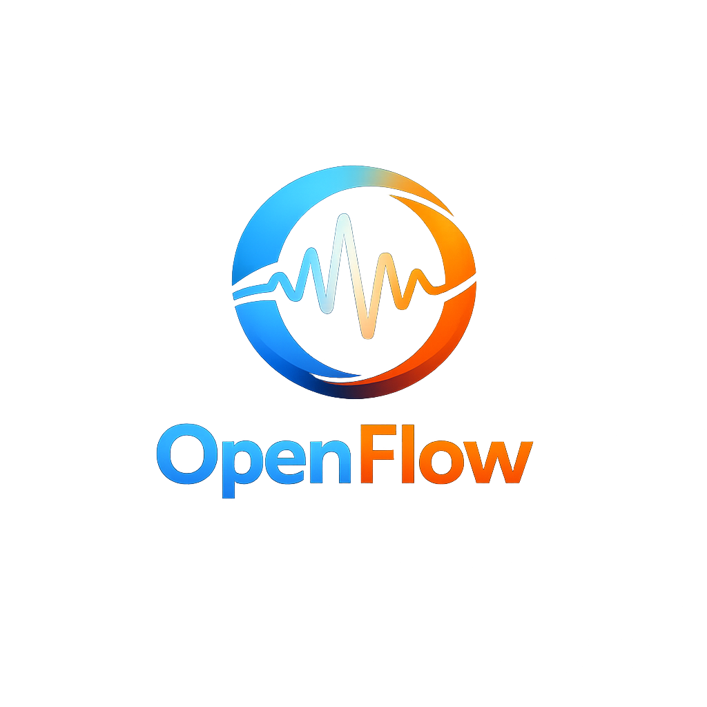

<p align="center">
  
</p>

<h1 align="center">Orbit</h1>

<p align="center">
  A macOS-native, GPU-accelerated, streaming speech-to-text menu bar app.
</p>

<p align="center">
  <a href="https://opensource.org/licenses/Apache-2.0"></a>
  <a href="https://www.apple.com/mac/"></a>
  <a href="https://www.python.org/downloads/"></a>
</p>

<p align="center">
  <a href="#features">Features</a> •
  <a href="#installation">Installation</a> •
  <a href="#usage">Usage</a> •
  <a href="#configuration">Configuration</a> •
  <a href="#tech-stack">Tech Stack</a>
</p>

---

OpenFlow is an open-source, local-first alternative to Wispr Flow. It provides instant voice dictation into any application using Apple Silicon's Neural Engine (via MLX) for ultra-low latency transcription. All processing happens on-device—no audio ever leaves your Mac.

## Features

| Feature | Description |
|---------|-------------|
| **Ultra-Low Latency** | Optimized for Apple Silicon using MLX (Metal) and `faster-whisper`. Sub-300ms transcription with the default `tiny` model. |
| **Private & Local** | All processing happens on-device. No audio ever leaves your Mac. |
| **Voice-Reactive UI** | Floating overlay that responds to your voice in real-time. |
| **Universal Dictation** | Inserts text directly into any active application via Accessibility APIs. |
| **Smart Denoising** | Integrated RNNoise for crystal-clear audio capture even in noisy environments. |
| **Easy Installation** | Simple setup with `make install` and `make run`. |

## Requirements

- **macOS** (Apple Silicon recommended)
- **Python** 3.11 or later
- **PortAudio** (`brew install portaudio`)

## Installation

```bash
git clone https://github.com/sammy4321/OpenFlow.git
cd OpenFlow
make install
```

The installer creates a virtual environment, compiles RNNoise, downloads Whisper models, and installs dependencies.

## Usage

```bash
make run
```

On first run, grant Accessibility permissions when prompted so OpenFlow can insert text into applications. The app runs in your menu bar—click to start dictating.

## Configuration

### Model Selection

By default, OpenFlow uses the `tiny` model for maximum speed. You can switch to larger models for better accuracy:

```bash
make run MODEL=base
make run MODEL=small
make run MODEL=medium
```

Supported models: `tiny`, `base`, `small`, `medium`, `large-v3` (availability depends on your machine's memory).

## Project Structure

```
OpenFlow/
├── openflow/
│   ├── main.py          # Entry point, accessibility checks
│   ├── app.py           # Menu bar app, rumps integration
│   ├── whisper_engine.py # MLX / faster-whisper transcription
│   ├── audio.py         # PortAudio capture pipeline
│   ├── streamer.py      # Streaming audio chunks to engine
│   ├── overlay.py       # Voice-reactive floating UI
│   ├── statusbar.py     # Menu bar status icon
│   ├── hotkey.py        # Global shortcut handling
│   ├── accessibility.py # Text insertion via AX APIs
│   ├── config.py        # User preferences, model paths
│   ├── rnnoise.py       # RNNoise denoising wrapper
│   └── updater.py       # Update checks
├── scripts/
│   ├── install.sh       # Main installer
│   ├── bootstrap_python.sh
│   ├── install_rnnoise.sh
│   └── install_models.sh
├── resources/
│   └── icon.png
├── Makefile
├── setup.py
├── requirements.txt
└── README.md
```

## Tech Stack

- [MLX](https://github.com/ml-explore/mlx) — Apple Silicon–optimized ML framework
- [faster-whisper](https://github.com/SYSTRAN/faster-whisper) — Whisper transcription (CPU fallback)
- [mlx-whisper](https://github.com/ukatz/mlx-whisper) — MLX-native Whisper for lowest latency
- [RNNoise](https://github.com/xiph/rnnoise) — Real-time noise suppression
- [rumps](https://github.com/jaredks/rumps) — Minimal macOS menu bar app framework
- [sounddevice](https://python-sounddevice.readthedocs.io/) — PortAudio bindings for audio capture

## Contributing

Contributions are welcome. Please:

1. Fork the repository
2. Create a feature branch (`git checkout -b feature/AmazingFeature`)
3. Commit your changes (`git commit -m 'Add some AmazingFeature'`)
4. Push to the branch (`git push origin feature/AmazingFeature`)
5. Open a Pull Request

## License

Licensed under the [Apache License 2.0](LICENSE).

## Topics

`macos` `speech-to-text` `dictation` `whisper` `mlx` `apple-silicon` `menu-bar` `local-first` `privacy`
